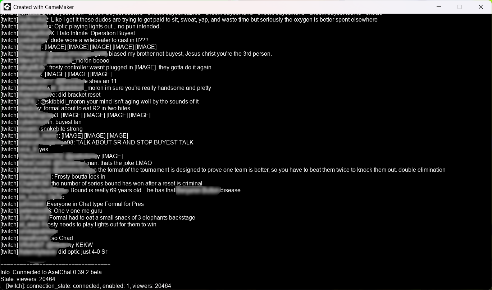

# AxelChatClientGM
GameMaker client for communication with AxelChat via WebSocket

## How to add AxelChat support to your project
1. Run this project and AxelChat to make sure it works. Check if connection to AxelChat is happening
2. Copy group (aka folder) `AxelChat client` with all its contents from this project to your project

## How connect to AxelChat
1. Place `o_axelchat_client` to any room
2. In `o_axelchat_client` open `Variable Definitions` and set variables of instance/object:
	* `server_address` - The address of the server where AxelChat is running. If AxelChat is running on the same device as the GameMaker project, then enter `127.0.0.1`. Otherwise, you can find the address in the AxelChat settings
    * `server_port` - AxelChat server port. Usually it is `8356`. You can get it in the settings of AxelChat
	* `on_connected_script` - Script that will be called upon successful connection to AxelChat. You must create your own script and specify it here. See the example for how the script should look like
    * `on_state_changed` - Script that will be called when the state of AxelChat changes. For example, when the number of viewers changes. You must create your own script and specify it here. See the example for how the script should look like
    * `on_message_received_script` - Script that will be called when a message is received. You must create your own script and specify it here. See the example for how the script should look like
3. Launch the room where the `o_axelchat_client` is located. Connection to AxelChat will occur automatically if AxelChat is launched and parameters of `o_axelchat_client` are specified correctly

## How disconnect from AxelChat
Just destroy instance of `o_axelchat_client`
